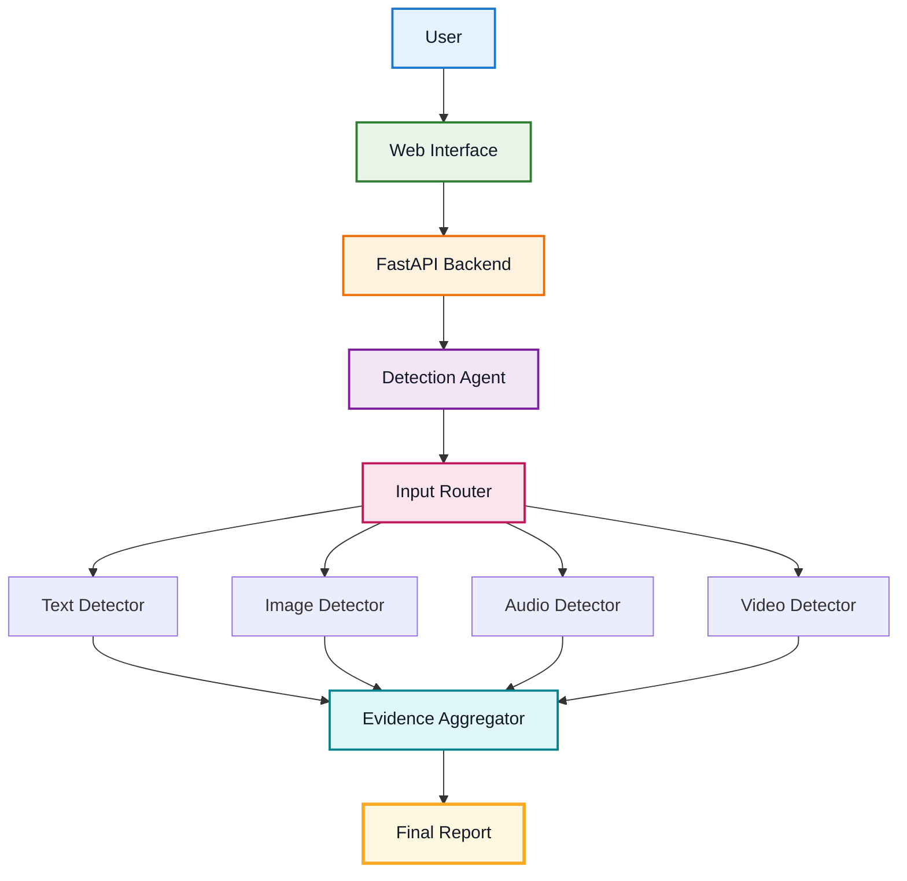
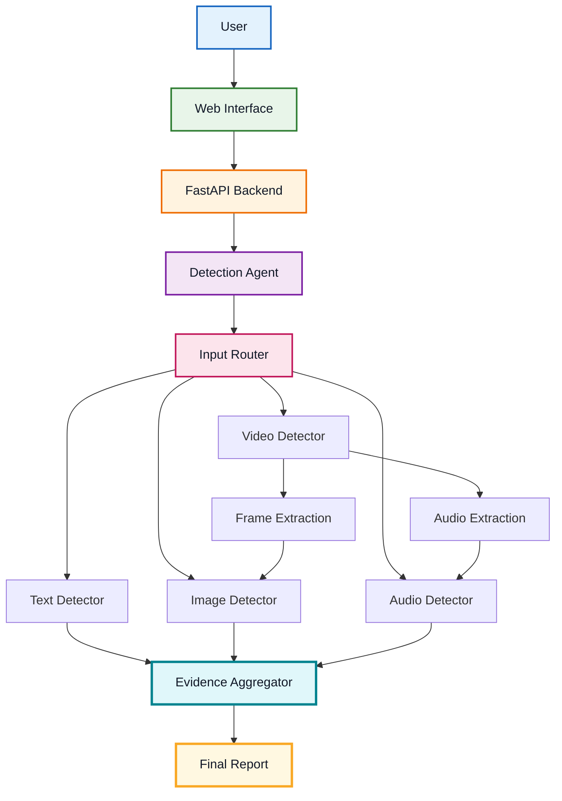

# System Architecture

---

##  High-Level Architecture



---

##  Processing Pipeline

The system follows a modular processing pipeline:

```text
  USER
   │
   ▼
  WEB INTERFACE
   │
   ▼
  FASTAPI BACKEND
   │
   ▼
  DETECTION AGENT
   │
   ▼
  INPUT ROUTER
   │
   ├──────────────┬──────────────┬──────────────┐
   ▼              ▼              ▼              ▼
  TEXT          IMAGE           AUDIO            VIDEO
DETECTOR       DETECTOR       DETECTOR       DETECTOR
   │              │              │              │
   └──────────────┴──────────────┴──────────────┘
                          │
                          ▼
                      EVIDENCE
                   AGGREGATOR
                          │
                          ▼
                      FINAL REPORT
```

---

#  Complete System Architecture



---

#  Architecture Principles

| Principle             | Description                                         |
| --------------------- | --------------------------------------------------- |
|  **Modular**        | Each modality has its own specialized detector      |
|  **Extensible**     | New detectors can be added through the router       |
|  **Scalable**        | FastAPI provides a lightweight asynchronous backend |
|  **Intelligent**    | Detection Agent orchestrates the analysis pipeline  |
|  **Evidence-Based** | Results are supported by detector-level evidence    |
|  **Multi-Modal**    | Video combines visual and audio analysis            |
|  **Unified Output** | All evidence is consolidated into one final report  |

---
