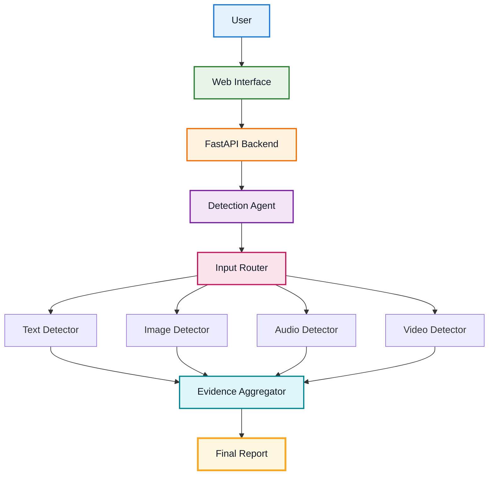
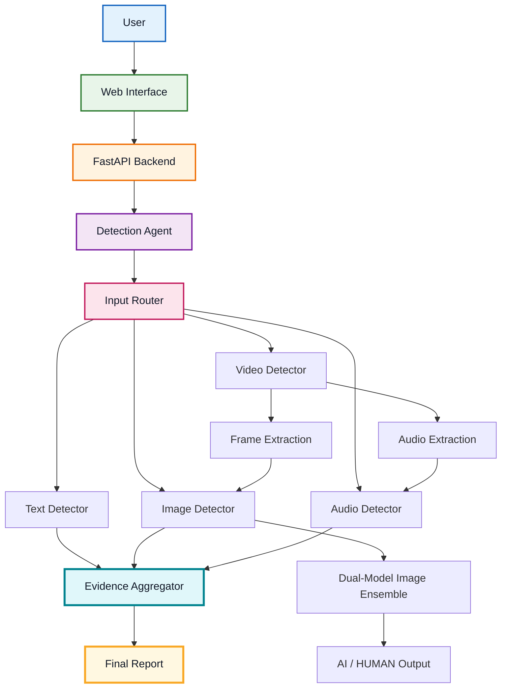

# System Architecture

---

## Implemented Scope

The current implementation includes a file-based multimodal agent that routes
text, image, and audio inputs to modality-specific logic. It does not yet
include the web interface, FastAPI integration, evidence aggregator, final
report flow, or video detection shown in the target architecture diagrams
below; those remain planned system architecture.

Supported file extensions are `.txt`, `.md`, and `.csv` for text; `.jpg`,
`.jpeg`, `.png`, and `.webp` for images; and `.wav`, `.mp3`, `.ogg`, `.m4a`,
and `.flac` for audio. Video is not currently supported.

The text route runs the three-model detector ensemble, and the audio route
runs the two-model primary-decision ensemble. The image route applies the
two-model decision policy to scores supplied by the caller; image loading and
model inference are not yet wired into the multimodal agent.

## High-Level Architecture

```mermaid
flowchart TD

    U["User"] --> UI["Web Interface"]
    UI --> API["FastAPI Backend"]
    API --> DA["Detection Agent"]
    DA --> IR["Input Router"]

    IR --> TD["Text Detector"]
    IR --> ID["Image Detector"]
    IR --> AD["Audio Detector"]
    IR --> VD["Video Detector"]

    TD --> EA["Evidence Aggregator"]
    ID --> EA
    AD --> EA
    VD --> EA

    EA --> FR["Final Report"]

    style U fill:#e3f2fd,stroke:#1976d2,color:#111827,stroke-width:2px
    style UI fill:#e8f5e9,stroke:#2e7d32,color:#111827,stroke-width:2px
    style API fill:#fff3e0,stroke:#ef6c00,color:#111827,stroke-width:2px
    style DA fill:#f3e5f5,stroke:#7b1fa2,color:#111827,stroke-width:2px
    style IR fill:#fce4ec,stroke:#c2185b,color:#111827,stroke-width:2px
    style EA fill:#e0f7fa,stroke:#00838f,color:#111827,stroke-width:2px
    style FR fill:#fff8e1,stroke:#f9a825,color:#111827,stroke-width:3px
```

---

# Complete System Architecture

```mermaid
flowchart TD

    USER["User"]
    WEB["Web Interface"]
    API["FastAPI Backend"]
    AGENT["Detection Agent"]
    ROUTER["Input Router"]

    TEXT["Text Detector"]
    IMAGE["Image Detector"]
    AUDIO["Audio Detector"]
    VIDEO["Video Detector"]

    FRAMES["Frame Extraction"]
    AUDIO_EXT["Audio Extraction"]

    AGG["Evidence Aggregator"]
    REPORT["Final Report"]

    USER --> WEB
    WEB --> API
    API --> AGENT
    AGENT --> ROUTER

    ROUTER --> TEXT
    ROUTER --> IMAGE
    ROUTER --> AUDIO
    ROUTER --> VIDEO

    IMAGE --> IMG_ENSEMBLE["Dual-Model Image Ensemble"]
    IMG_ENSEMBLE --> IMG_RESULT["AI / HUMAN Output"]

    VIDEO --> FRAMES
    VIDEO --> AUDIO_EXT

    FRAMES --> IMAGE
    AUDIO_EXT --> AUDIO

    TEXT --> AGG
    IMAGE --> AGG
    AUDIO --> AGG

    AGG --> REPORT

    style USER fill:#e3f2fd,stroke:#1565c0,color:#111827,stroke-width:2px
    style WEB fill:#e8f5e9,stroke:#2e7d32,color:#111827,stroke-width:2px
    style API fill:#fff3e0,stroke:#ef6c00,color:#111827,stroke-width:2px
    style AGENT fill:#f3e5f5,stroke:#7b1fa2,color:#111827,stroke-width:2px
    style ROUTER fill:#fce4ec,stroke:#c2185b,color:#111827,stroke-width:2px
    style AGG fill:#e0f7fa,stroke:#00838f,color:#111827,stroke-width:3px
    style REPORT fill:#fff8e1,stroke:#f9a825,color:#111827,stroke-width:3px
```

---

# Architecture Principles

| Principle          | Description                                         |
| ------------------ | --------------------------------------------------- |
| **Modular**        | Each modality has its own specialized detector      |
| **Extensible**     | New detectors can be added through the router       |
| **Scalable**       | FastAPI provides a lightweight asynchronous backend |
| **Intelligent**    | Detection Agent orchestrates the analysis pipeline  |
| **Evidence-Based** | Results are supported by detector-level evidence    |
| **Multi-Modal**    | Video combines visual and audio analysis            |
| **Image-Ready**    | Image detection already uses a two-model ensemble   |
| **Unified Output** | All evidence is consolidated into one final report  |

---

## Current Image Detector Design

The image branch uses two classifiers:

- `Ateeqq/ai-vs-human-image-detector` as the supporting model
- `haywoodsloan/ai-image-detector-deploy` as the primary decision model

The ensemble compares the binary labels from both models. If they agree, the shared label is kept. If they disagree, the model-2 decision wins and the confidence indicator is capped at `Moderate`. The result is returned in a normalized payload with the modality, label, score, and model-level telemetry. Currently, the multimodal agent receives the two model scores from its caller instead of running image-model inference.

## Current Audio Detector Design

The audio detector runs Model 1 for supporting telemetry, then Model 2 as the primary decision-maker. Model 2's AI probability is compared with a `0.90` threshold to produce the final `AI` or `HUMAN` label. The result includes each model's native and normalized label, model agreement, primary/final alignment, confidence indicator, and decision threshold. The audio branch feeds its result into the system's evidence aggregation flow. See [audio-detector.md](./audio-detector.md) for the execution graph, result schema, tests, and evaluation artifacts.

---
