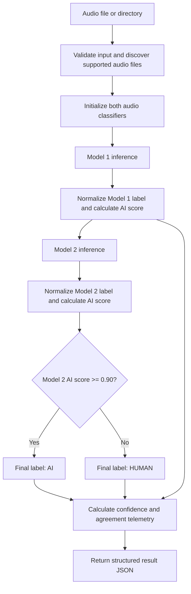

# Audio Detector Architecture & Pipeline

The audio detector is complete for the current project scope and has been manually tested. It provides a reusable two-model detector package, a file/directory CLI, deterministic unit tests, and evaluation/analysis scripts. The configured decision policy and output contract are described below.

## System architecture and decision logic

Model 1 provides supporting telemetry; Model 2 determines the final label using its AI probability and the calibrated threshold `0.90`.

| Model | Native labels | Normalized labels | Role |
|---|---|---|---|
| `Sayantan090/audio-fake-detector` | `FAKE`, `REAL` | `AI`, `HUMAN` | Supporting model and agreement telemetry |
| `Mahmoud59/wav2vec2-fake-audio-detector` | `LABEL_0`, `LABEL_1` | `AI`, `HUMAN` | Primary decision model; threshold `0.90` |

For Model 1, `FAKE` maps to `AI` and `REAL` maps to `HUMAN`. For Model 2, `LABEL_0` maps to `AI` and `LABEL_1` maps to `HUMAN`. Each model's `ai_score` is calculated from its normalized class: the score is used directly for `AI`, and inverted (`1.0 - score`) for `HUMAN`.

The ensemble predicts with Model 1 and then Model 2. It compares Model 2's `ai_score` with `0.90`: scores at or above the threshold produce `AI`; lower scores produce `HUMAN`. Model 1 does not override that result. `models_agree` compares the models' normalized top labels, while `primary_agrees_with_final` compares Model 2's normalized top label with the final threshold-based label. The confidence indicator is derived from the final label's score.

## Execution graph



The flow diagram describes the detector's execution sequence; the implementation is the reusable Python ensemble and CLI.

## Standard output schema

Each result includes:

```json
{
  "modality": "audio",
  "label": "AI",
  "model_score": 0.9991,
  "confidence_indicator": "High",
  "model_1": {
    "name": "Sayantan090/audio-fake-detector",
    "raw_label": "FAKE",
    "normalized_label": "AI",
    "score": 0.9854,
    "ai_score": 0.9854
  },
  "model_2": {
    "name": "Mahmoud59/wav2vec2-fake-audio-detector",
    "raw_label": "LABEL_0",
    "normalized_label": "AI",
    "score": 0.9991,
    "ai_score": 0.9991
  },
  "models_agree": true,
  "primary_agrees_with_final": true,
  "decision_model": "Mahmoud59/wav2vec2-fake-audio-detector",
  "decision_threshold": 0.9,
  "file_name": "10.wav"
}
```

`file_name` is added by the CLI. The reusable ensemble result also reports the fields above except `file_name`; callers can add a filename or path as appropriate.

## Running and testing

Run the audio unit tests (no model downloads or evaluation corpus required):

```bash
python -m pytest tests/test_audio_label_normalization.py tests/test_audio_detector_package.py -q
```

Run inference on one supported audio file or recursively on a directory:

```bash
python scripts/audio_detector/pipeline.py --input path/to/audio.wav
```

The pretrained model weights must be downloadable or already cached. The directory pipeline accepts `.mp3`, `.m4a`, `.wav`, and `.ogg` files.

The complete test suite can be run with:

```bash
python -m pytest -q
```

## Evaluation artifacts

Evaluation and analysis scripts write their outputs to `results/`:

- `audio_detector_model_comparison.csv` — comparative per-model metrics
- `audio_detector_ensemble_evaluation.csv` — threshold-gated ensemble grid metrics
- `audio_detector_disagreement_analysis.csv` — per-sample comparison and disagreement analysis
- `audio_detector_model_1_results.csv` and `audio_detector_model_2_results.csv` — per-model predictions and scores
- `audio_detector_model_1_thresholds.csv` and `audio_detector_model_2_thresholds.csv` — per-model threshold sweeps
- `audio_detector_duration_analysis.csv` and `audio_detector_duration_analysis_fixed.csv` — duration and inference-time analysis

These files are produced by the evaluation scripts and are present after those scripts have been run. An evaluation corpus is required to regenerate benchmark artifacts.

## Optimization

Audio chunking / sliding-window segmentation is an optional future optimization, not a prerequisite for the current completed detector. Any chunking strategy should be evaluated for both inference latency and prediction quality before adoption.